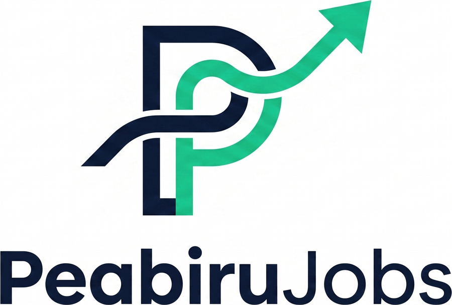
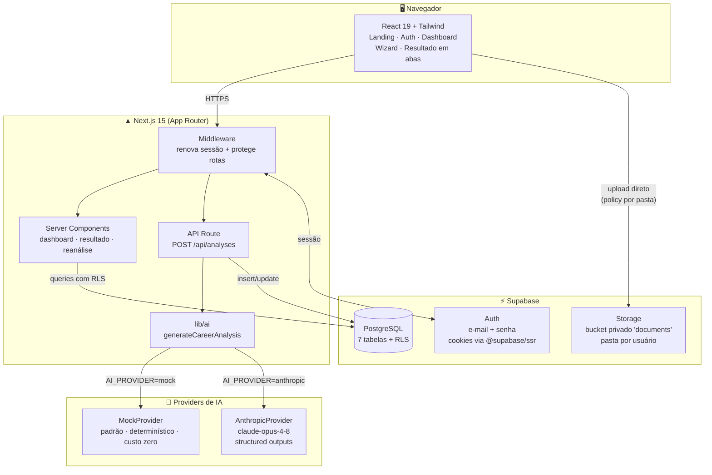
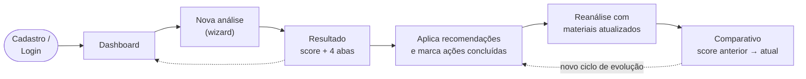
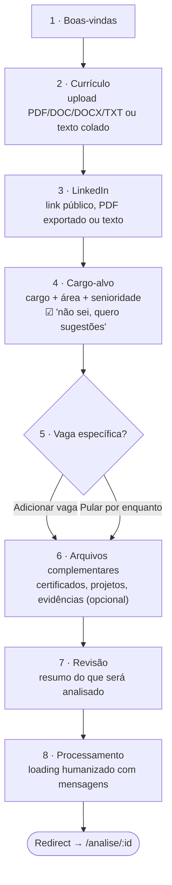
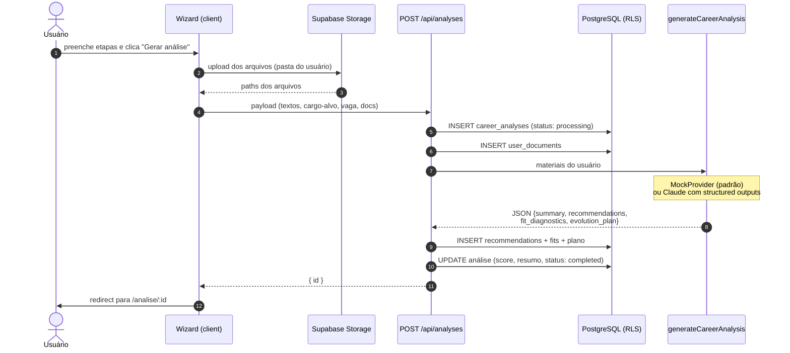
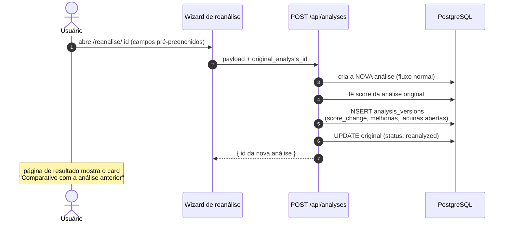
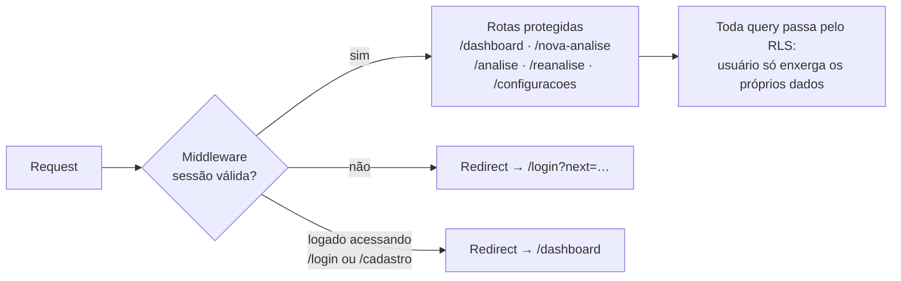
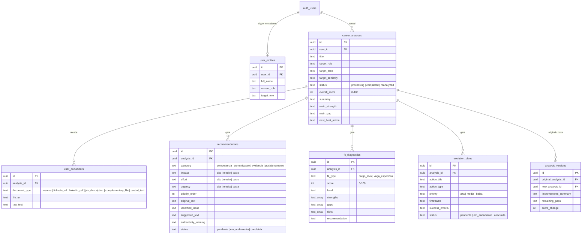
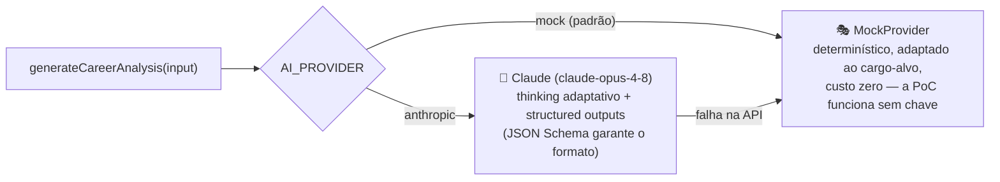

<div align="center">



### Mentor de carreira com IA para profissionais brasileiros

*Transforme sua experiência profissional em uma narrativa mais clara e competitiva.*

<br/>


<br/>

[O produto](#-o-produto) •
[Funcionalidades](#-funcionalidades) •
[Arquitetura](#-arquitetura) •
[Fluxos](#-fluxos-do-produto) •
[Banco de dados](#-modelo-de-dados) •
[IA](#-camada-de-ia) •
[Como rodar](#-como-rodar) •
[Segurança](#-segurança)

</div>

---

## 🎯 O produto

O **PeabiruJobs** é um aplicativo web B2C para profissionais brasileiros em **recolocação ou transição de carreira**. Ele funciona como um mentor de carreira com IA: analisa currículo, LinkedIn, cargo-alvo e vagas de interesse para ajudar o usuário a **comunicar melhor a trajetória que já tem** — e a decidir com mais estratégia onde investir energia.

> O nome vem do **Peabiru**, a rede de caminhos indígenas pré-colombianos que conectava o litoral ao interior da América do Sul — uma trilha já existente que só precisava ser percorrida com orientação. É exatamente a proposta do produto: o caminho profissional do usuário já existe; a plataforma ajuda a enxergá-lo e comunicá-lo.

### Princípios inegociáveis

| ✅ O que o produto faz | ❌ O que o produto NÃO faz |
| --- | --- |
| Traduz experiências **reais** para linguagem de mercado | **Não inventa** experiências, métricas ou certificações |
| Diferencia lacuna real de lacuna de comunicação | **Não promete** contratação nem aprovação em vagas |
| Prioriza ajustes por impacto × esforço × urgência | **Não transforma** atividade operacional em cargo de liderança |
| Emite alertas de autenticidade nas sugestões de texto | **Não substitui** recrutadores nem processos seletivos |

---

## ✨ Funcionalidades

O MVP é focado em **3 funcionalidades centrais**, sustentadas por uma estrutura básica de produto (autenticação, dashboard, fluxo de análise e página de resultado).

### 1️⃣ Recomendações + tradução contextual da experiência

Analisa os materiais do usuário e gera uma lista de recomendações **priorizadas**, cada uma com:

- Categoria (`Competência` · `Comunicação` · `Evidência` · `Posicionamento`)
- **Impacto**, **esforço** e **urgência** (badges coloridos na UI)
- Ação sugerida + justificativa ("por quê")
- **Tradução contextual**: trecho original identificado → problema de comunicação → versão sugerida → termos de mercado relacionados
- ⚠️ Alerta de autenticidade quando há texto sugerido
- Botões *"Marcar como feita"* e *"Copiar sugestão"*, filtro por categoria

### 2️⃣ Diagnóstico de aderência

Mostra o quanto o perfil está alinhado ao **cargo-alvo** e, quando enviada, à **vaga específica**:

- **Score de 0 a 100** (anel de score visual) + nível textual (`Baixa aderência` → `Alta aderência`)
- Pontos fortes, lacunas e riscos separados
- Distinção explícita entre **lacuna real**, **lacuna de comunicação** e **lacuna de evidência**
- Recomendação final clara: `Aplicar agora` · `Aplicar com ajustes` · `Desenvolver lacunas antes de aplicar` · `Não priorizar esta vaga`

### 3️⃣ Plano de evolução + acompanhamento + reanálise

Transforma o diagnóstico em um plano prático:

- Ações com tipo, prioridade, **prazo sugerido** e **critério de sucesso**
- Status persistido (`Pendente` → `Em andamento` → `Concluído`) com barra de progresso
- **Reanálise**: novo ciclo com materiais atualizados e **comparativo automático** (score anterior → atual, recomendações concluídas, lacunas que continuam abertas)

---

## 🏗 Arquitetura

Visão geral de alto nível — Next.js App Router como aplicação única (SSR + API), Supabase como backend gerenciado e camada de IA plugável:



### Estrutura de pastas

```
app/
├── page.tsx                     # Landing page pública
├── (auth)/                      # Rotas de autenticação
│   ├── login/
│   ├── cadastro/
│   └── recuperar-senha/
├── (app)/                       # Área autenticada (middleware + layout com guard)
│   ├── dashboard/               # Resumo + histórico de análises
│   ├── nova-analise/            # Wizard de 8 etapas
│   ├── analise/[id]/            # Resultado em 4 abas
│   ├── reanalise/[id]/          # Wizard pré-preenchido + comparativo
│   ├── configuracoes/           # Perfil simples
│   └── redefinir-senha/
├── auth/callback/               # Troca de código por sessão (confirmação/recovery)
└── api/analyses/                # Orquestra a geração da análise

components/
├── ui/                          # Design system: Button, Card, Badge, Tabs,
│                                # ScoreRing, ProgressBar, Toast, EmptyState…
├── app/                         # Shell: NavLinks, LogoutButton
├── wizard/AnalysisWizard.tsx    # Fluxo compartilhado (análise + reanálise)
└── result/                      # OverviewTab, RecommendationsTab, FitTab, PlanTab

lib/
├── supabase/                    # Clients browser/server + middleware de sessão
├── ai/                          # generateCareerAnalysis + providers + tipos
└── types.ts                     # Tipos de domínio (espelham o schema)

supabase/migrations/0001_init.sql  # Tabelas + RLS + trigger + Storage
```

---

## 🔀 Fluxos do produto

### Jornada completa do usuário



### Wizard de nova análise (8 etapas)



### Geração da análise (ponta a ponta)



### Reanálise e comparativo



### Autenticação e proteção de rotas



---

## 🗄 Modelo de dados

7 tabelas, todas com **Row Level Security**. Perfil criado automaticamente por trigger no cadastro.



---

## 🤖 Camada de IA

`lib/ai/generateCareerAnalysis.ts` é o **ponto único** de geração. Recebe os materiais do usuário e devolve sempre o mesmo contrato JSON:

```jsonc
{
  "summary": {
    "overall_score": 78,
    "general_diagnosis": "…",
    "main_strength": "…",
    "main_gap": "…",
    "next_best_action": "…"
  },
  "recommendations": [ /* categoria, impacto, esforço, urgência,
                          tradução contextual, alerta de autenticidade… */ ],
  "fit_diagnostics":  [ /* cargo_alvo e, se houver, vaga_especifica */ ],
  "evolution_plan":   [ /* ações com prazo e critério de sucesso */ ]
}
```

### Providers plugáveis



| Provider | Quando usar | Custo |
| --- | --- | --- |
| `mock` *(padrão)* | Desenvolvimento, demo, validação de UX | Zero |
| `anthropic` | Produção com análises reais | Por token (API Anthropic) |

Trocar de provider é **só variável de ambiente** — nenhuma mudança de código.

### As 15 regras da IA

O system prompt do provider real (e o comportamento do mock) seguem regras fixas de autenticidade:

1. Não inventar experiências · 2. Não criar métricas falsas · 3. Não afirmar domínio de ferramentas não mencionadas · 4. Não prometer contratação · 5. Não prever aprovação em vaga · 6. Justificar cada recomendação · 7. Diferenciar lacuna real de lacuna de comunicação · 8. Diferenciar lacuna de competência, evidência e posicionamento · 9. Linguagem clara, acolhedora e prática · 10. Recomendações específicas aos materiais enviados · 11. Sinalizar baixa confiança pedindo complemento · 12. Preservar autenticidade · 13. Não inflar atividade operacional para liderança · 14. Não adicionar certificações não informadas · 15. Não sugerir exageros que quebrem a confiança do usuário

---

## 🚀 Como rodar

### Pré-requisitos

- Node.js 20+
- Conta no [Supabase](https://supabase.com) (plano free é suficiente)

### 1 · Instalar dependências

```bash
npm install
```

### 2 · Configurar o Supabase

1. Crie um projeto em [supabase.com](https://supabase.com)
2. Abra o **SQL Editor** e execute o conteúdo de [`supabase/migrations/0001_init.sql`](supabase/migrations/0001_init.sql) — cria tabelas, RLS, trigger de perfil e o bucket privado de Storage de uma vez
3. Para testar sem SMTP: **Authentication → Providers → Email** → desative *"Confirm email"*

### 3 · Variáveis de ambiente

```bash
cp .env.example .env.local
```

| Variável | Obrigatória | Descrição |
| --- | :---: | --- |
| `NEXT_PUBLIC_SUPABASE_URL` | ✅ | URL do projeto (Settings → API) |
| `NEXT_PUBLIC_SUPABASE_ANON_KEY` | ✅ | Chave publishable/anon (Settings → API Keys) |
| `AI_PROVIDER` | — | `mock` *(padrão)* ou `anthropic` |
| `ANTHROPIC_API_KEY` | — | Apenas com `AI_PROVIDER=anthropic` |

### 4 · Rodar em desenvolvimento

```bash
npm run dev
# → http://localhost:3000
```

### 5 · Deploy na Vercel

1. Importe o repositório na [Vercel](https://vercel.com)
2. Configure as **mesmas variáveis de ambiente** acima (Settings → Environment Variables)
3. Deploy — sem configuração extra de build

> 💡 **Erro "Your project's URL and Key are required to create a Supabase client!"** no deploy = variáveis de ambiente não configuradas na Vercel (ou deploy feito antes de adicioná-las — faça um *Redeploy* após salvar).

---

## 🔒 Segurança

| Camada | Mecanismo |
| --- | --- |
| **Rotas** | Middleware verifica a sessão e redireciona não autenticados para `/login` |
| **Banco** | RLS em **todas** as tabelas — `auth.uid()` filtra tudo; tabelas filhas validam via join com `career_analyses` |
| **Storage** | Bucket privado com policy por pasta: usuário só lê/escreve em `documents/{seu_id}/…` |
| **Sessão** | Cookies httpOnly gerenciados por `@supabase/ssr`, renovados no middleware |
| **Chaves** | Apenas a chave *publishable* vai ao cliente (pública por design); nenhuma `service_role` é usada no projeto |

---

## 🧭 Decisões técnicas e limitações da PoC

| Decisão | Racional |
| --- | --- |
| **PDF/DOC não são parseados** nesta versão | Parsing server-side é frágil para PoC. Arquivos ficam salvos no Storage e vinculados à análise; o texto analisado vem do campo "colar texto" (`.txt` é lido no navegador). A interface da função de IA não muda quando um parser for plugado. |
| **Link do LinkedIn não é raspado** | Scraping viola os termos do LinkedIn. O link é armazenado como documento; o conteúdo vem do texto colado ou do PDF exportado. |
| **Mock determinístico** como padrão | Mesma entrada → mesma saída. Permite validar UX, banco e fluxo completo sem custo de IA. |
| **Tailwind v3.4** (não v4) | Config clássica, previsível e amplamente documentada para manutenção. |

### Roadmap natural

- [ ] Parser de PDF/DOCX server-side (alimentar `resume_text` automaticamente)
- [ ] Sugestão de cargos para quem marca *"não sei qual cargo buscar"*
- [ ] E-mails transacionais (boas-vindas, plano concluído, lembrete de reanálise)
- [ ] Exportar recomendações em PDF
- [ ] Histórico de evolução com gráfico de score ao longo das reanálises

---

<div align="center">

**PeabiruJobs** não promete contratação e não inventa experiências.<br/>
A proposta é ajudar você a comunicar melhor sua trajetória e tomar decisões mais estratégicas.

</div>
