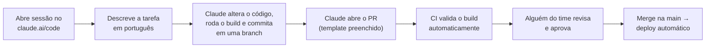

# 🤖 Guia do Claude Code para o time (inclusive não-técnicos)

> Como qualquer pessoa do time — **inclusive POs sem experiência com código** — pode contribuir com o PeabiruJobs usando o Claude Code. Este projeto inteiro foi construído assim.

## 1. O que é o Claude Code

O Claude Code é um agente de IA da Anthropic que **trabalha dentro do repositório**: lê o código, faz alterações, roda o build para verificar que nada quebrou, cria commits e abre Pull Requests. Você conversa em português, ele faz o trabalho técnico.

Existem 4 jeitos de usar:

| Interface | Para quem | Como |
| --- | --- | --- |
| 🌐 **Web — claude.ai/code** | **Não-técnicos (recomendado)** | Navegador, sem instalar nada |
| 💻 App desktop (Mac/Windows) | Quem prefere app nativo | Mesmo fluxo do web |
| ⌨️ CLI no terminal | Devs | `claude` na pasta do projeto |
| 🐙 Integração GitHub | Todos | Mencionar o Claude em issues/PRs |

Para POs, **use a versão web** — o resto deste guia assume ela.

## 2. Setup (uma vez só, ~5 minutos)

1. Acesse **[claude.ai/code](https://claude.ai/code)** e entre com sua conta Claude (peça ao admin o acesso ao plano do time, se houver)
2. Conecte sua conta **GitHub** quando solicitado
3. Autorize o repositório **`akamitatrush/PeabiruJobs`** (você precisa ter sido adicionado como colaborador antes — ver [onboarding](onboarding.md) §1)
4. Crie uma **sessão** selecionando o repositório — pronto, é um chat

> 💡 O repositório tem um arquivo `CLAUDE.md` na raiz que o Claude Code lê automaticamente ao iniciar. Ele já conhece as convenções, as regras de produto e o que nunca fazer — você não precisa explicar o projeto a cada sessão.

## 3. Como pedir bem (a habilidade que importa)

O Claude trabalha melhor com **resultado esperado + contexto**, não com instruções técnicas. Compare:

| ❌ Pedido vago | ✅ Pedido bom |
| --- | --- |
| "Melhora a landing" | "Na landing page, troque o subtítulo do hero para enfatizar transição de carreira. Tom acolhedor, sem prometer contratação" |
| "Arruma o bug" | "Ao marcar uma recomendação como feita e recarregar a página, ela volta para pendente. Corrija e me explique a causa" |
| "Faz a feature de export" | "Quero exportar as recomendações de uma análise em PDF. Antes de codar, me proponha 2 abordagens com prós e contras" |

**5 regras práticas:**

1. **Uma tarefa por sessão** — pedidos pequenos e focados geram PRs fáceis de revisar
2. **Diga o resultado, não o como** — "quero que o usuário consiga X" em vez de "altere o arquivo Y"
3. **Aponte para a documentação** — "seguindo os critérios do docs/produto.md, épico 2…"
4. **Peça explicação junto** — "faça e me explique o que mudou como se eu não fosse técnico"
5. **Peça o PR no final** — "abra um PR com essas mudanças" (nunca peça para mergear direto na `main`)

## 4. O que um PO pode fazer sozinho × o que pedir com um dev junto

### ✅ Seguro para fazer sozinho (baixo risco, CI + review protegem)

- Textos e microcopy (landing, botões, mensagens, e-mails)
- Documentação: user stories, critérios de aceite, FAQ, roadmap em `docs/`
- Ajustes visuais simples (espaçamento, cores, ordem de seções)
- Investigação: "explique como funciona o fluxo de reanálise", "quantas telas usam o componente X?"
- Rascunho de features novas para discussão ("me mostre como ficaria…")

### ⚠️ Fazer com um dev acompanhando o PR

- Mudanças no banco de dados (migrations) ou em autenticação/segurança
- Alterações na camada de IA (prompts, regras de autenticidade)
- Mexer no fluxo de pagamento (quando existir) ou em variáveis de ambiente

O Claude *consegue* fazer tudo isso — a questão é quem revisa. A regra do projeto: **nada entra na `main` sem PR com CI verde e review**, então o pior cenário de um pedido mal-sucedido é um PR rejeitado. Errar é barato.

## 5. Fluxo completo de uma contribuição

Se o revisor pedir ajustes, volte à mesma sessão e diga o que mudar — o Claude atualiza o PR.

## 6. Regras de ouro (segurança)

1. **Nunca cole segredos no chat**: chaves `service_role`, tokens `sbp_…`, `ANTHROPIC_API_KEY`, senhas. A única chave que pode circular é a anon/publishable do Supabase
2. **Não peça merge direto na `main`** — sempre PR
3. **Leia o resumo do Claude antes de aprovar** — ele explica o que fez; se não entendeu, pergunte ("explica de novo sem jargão")
4. **Desconfie de "tudo pronto" sem PR** — o artefato final de qualquer sessão de mudança é um Pull Request que o time consegue revisar

## 7. Prompts prontos para copiar (adaptados a este projeto)

**Texto/copy:**
> Na landing page (`app/page.tsx`), reescreva a seção "O que você recebe" deixando os benefícios mais concretos para quem está desempregado. Mantenha o tom do projeto (claro, acolhedor, sem prometer contratação). Abra um PR.

**Documentação de produto:**
> Leia `docs/produto.md` e adicione um épico 5 para "exportar recomendações em PDF", com 3 user stories e critérios de aceite no mesmo formato dos épicos existentes. Abra um PR.

**Investigação (não muda nada):**
> Me explique, como se eu não fosse técnico, o que acontece desde o clique em "Gerar análise" até o resultado aparecer. Onde a IA entra? O que é salvo no banco?

**Bug report:**
> No fluxo de nova análise, quando faço X acontece Y (esperava Z). Investigue a causa, corrija, rode o build e abra um PR explicando o problema em linguagem simples.

**Proposta de feature (sem codar ainda):**
> Quero notificar o usuário por e-mail quando ele concluir todas as ações do plano. Antes de implementar: proponha a abordagem, o que precisa de infra nova e os riscos. Não altere código ainda.

## 8. Aprendendo no caminho

Peça para o Claude te ensinar enquanto trabalha — ele é ótimo nisso:

> "Antes de fazer, me explique em 3 frases o que é uma migration e por que este projeto exige uma nova em vez de editar a antiga."

Com algumas sessões assim, o vocabulário técnico do time nivela sozinho.
