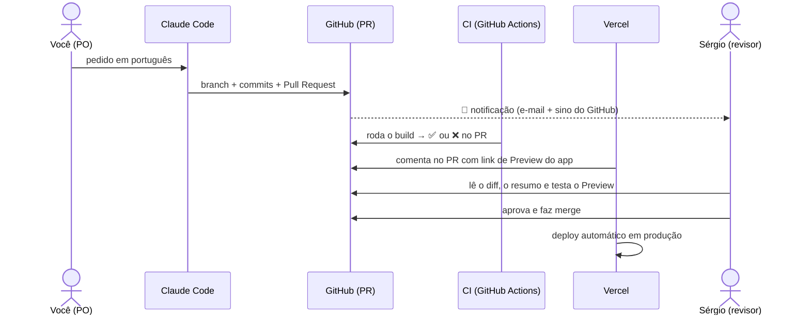

# 🤖 Guia do Claude Code — do zero absoluto à primeira contribuição

> Para **qualquer pessoa do time**, inclusive quem nunca programou e nunca usou o Claude Code. Passo a passo literal: o que criar, onde clicar, o que esperar e como seu trabalho chega até quem revisa — **sem precisar de acesso à Vercel**.

---

## 1. O que é o Claude Code (em 30 segundos)

É um agente de IA da Anthropic que trabalha **dentro do repositório do projeto**: lê o código, faz alterações, roda verificações, cria commits e abre Pull Requests (PRs). Você escreve em português o que quer; ele executa a parte técnica e te explica o que fez.

**O ponto mais importante deste guia:** todo o trabalho vira um **Pull Request no GitHub**. É assim que o Sérgio (e o resto do time) vê, revisa e aprova o que você fez. Você não precisa de acesso à Vercel, ao Supabase nem a qualquer outra ferramenta — **o GitHub é o ponto de encontro de tudo**.

---

## 2. O que você precisa ANTES de começar (checklist única)

| # | Item | Como conseguir |
| --- | --- | --- |
| 1 | **Conta no GitHub** (gratuita) | [github.com/signup](https://github.com/signup) → e-mail, senha, nome de usuário |
| 2 | **Convite para o repositório** | Peça ao Sérgio para te adicionar: ele vai em *Settings → Collaborators → Add people* e digita seu usuário. **Você recebe um e-mail do GitHub — clique em "Accept invitation"** (sem isso, nada funciona) |
| 3 | **Conta no Claude com plano pago** | [claude.ai](https://claude.ai) → o Claude Code exige plano **Pro ou superior** (ou fazer parte do plano Team da empresa, se houver) |

Só isso. Nada de Vercel, nada de Supabase, nada de instalar programa (no caminho Web).

---

## 3. Caminho A — pelo navegador (recomendado para não-técnicos)

### Primeira vez (configuração única, ~5 minutos)

1. Abra **[claude.ai/code](https://claude.ai/code)** no navegador e faça login na sua conta Claude
2. Clique para criar uma nova sessão — na primeira vez, ele vai pedir para **conectar seu GitHub**
3. Vai abrir uma tela do GitHub pedindo autorização do app do Claude. Clique em **Authorize/Install**
4. Na tela de escolha de repositórios, selecione **Only select repositories** → marque **`akamitatrush/PeabiruJobs`** → confirme
   - ⚠️ Se o repositório **não aparece na lista**: você não aceitou o convite do passo 2 do checklist. Procure o e-mail "invitation" do GitHub e aceite primeiro
5. De volta ao Claude, selecione o repositório **PeabiruJobs** e crie a sessão

### Toda vez que for contribuir (o ciclo normal)

1. **Abra uma sessão nova** em claude.ai/code selecionando o PeabiruJobs
2. **Escreva o pedido em português**, com resultado esperado + contexto. Exemplo real e completo:

   > Na landing page, na seção "Como funciona", o passo 2 diz "Informe um cargo-alvo ou uma vaga". Quero deixar mais claro que a vaga é opcional. Troque por algo como "Informe seu cargo-alvo (e uma vaga específica, se tiver)". Rode o build para garantir que nada quebrou e **abra um Pull Request** com a mudança.

3. **Acompanhe o Claude trabalhando** — você vê na tela ele lendo arquivos, editando e rodando comandos. Pode interromper e redirecionar a qualquer momento ("espera, na verdade quero outro texto")
4. **Ao final, ele te dá o link do Pull Request.** Esse link é o seu entregável
5. **Cole o link no canal do time** (ou marque o Sérgio). Fim da sua parte

> 💡 O repositório tem um arquivo `CLAUDE.md` que toda sessão lê automaticamente — o Claude já conhece as convenções e as regras do produto. Você não precisa explicar o projeto.

---

## 4. Caminho B — pelo terminal (para quem quer aprender o jeito dev)

Requer instalar ferramentas. Se o caminho A te atende, pule esta seção sem culpa.

1. **Instale o Git**: [git-scm.com/downloads](https://git-scm.com/downloads) (Windows: aceite as opções padrão)
2. **Instale o Node.js 20+**: [nodejs.org](https://nodejs.org) (versão LTS)
3. **Instale o Claude Code** — abra o terminal (Windows: "Git Bash"; Mac: "Terminal") e rode:
   ```bash
   npm install -g @anthropic-ai/claude-code
   ```
4. **Autentique o GitHub e clone o projeto**:
   ```bash
   git clone https://github.com/akamitatrush/PeabiruJobs.git
   cd PeabiruJobs
   ```
   (o Git vai pedir login do GitHub na primeira vez — siga as instruções na tela)
5. **Inicie o Claude Code** dentro da pasta:
   ```bash
   claude
   ```
   Na primeira vez ele abre o navegador para você logar na conta Claude
6. A partir daí é igual ao caminho A: **escreva o pedido em português** no chat do terminal. Ao final, peça: *"crie uma branch, commite e abra um Pull Request"*

---

## 5. "O Sérgio não vai me dar acesso à Vercel — como ele vê o que eu fiz?"

**Ele não precisa te dar, e você não precisa ter.** O fluxo foi desenhado para que tudo apareça sozinho para quem revisa. Veja o que acontece automaticamente quando o Claude abre o seu PR:



Em palavras:

1. **Notificação:** o Sérgio recebe e-mail do GitHub e vê o PR na aba **Pull Requests** do repositório. Se quiser garantia, cole o link do PR no grupo do time
2. **O PR mostra tudo:** a descrição (o template é preenchido com resumo e "como testar"), cada linha alterada (diff) e o resultado do **CI** — um ✅ verde significa "o projeto compila com essa mudança"
3. **Preview da Vercel:** a Vercel comenta **dentro do PR** com um link tipo `peabirujobs-git-sua-branch....vercel.app` — uma **cópia do app rodando com a sua mudança**, sem tocar na produção. O Sérgio clica e vê na tela, não só no código
   - Obs.: se esse link pedir login da Vercel ao abrir, é a proteção de preview ativada — o Sérgio resolve uma única vez em *Vercel → Settings → Deployment Protection*
4. **Merge = produção:** quando o Sérgio aprova e mergeia na `main`, a Vercel publica sozinha. Você nunca aperta "deploy"

**Resumindo o seu papel:** entregar um link de PR. Todo o resto (validação, preview, deploy) é automático.

---

## 6. E se o revisor pedir mudanças?

1. O Sérgio comenta no PR (você recebe e-mail do GitHub)
2. **Volte à mesma sessão** do Claude Code (elas ficam salvas em claude.ai/code) e diga: *"No PR que abrimos, o Sérgio pediu para X. Faça o ajuste e atualize o PR"*
3. O Claude commita na mesma branch — **o PR atualiza sozinho**, não precisa abrir outro

---

## 7. O que fazer sozinho × o que fazer com um dev por perto

### ✅ Seguro para fazer sozinho

- Textos e microcopy (landing, botões, mensagens)
- Documentação: user stories, critérios de aceite, FAQ, roadmap em `docs/`
- Ajustes visuais simples (espaçamentos, cores, ordem de seções)
- Investigações que não mudam nada: "explique como funciona X"
- Rascunhos de feature para discussão

### ⚠️ Marque um dev como revisor do PR

- Banco de dados (migrations), autenticação, segurança
- Camada de IA (prompts, regras de autenticidade)
- Variáveis de ambiente e infraestrutura

O Claude *consegue* fazer tudo — a questão é quem revisa. Como **nada entra na `main` sem PR aprovado + CI verde**, o pior cenário de um pedido mal-feito é um PR recusado. **Errar é barato; use isso para aprender.**

---

## 8. Erros comuns de iniciante (e a solução)

| Sintoma | Causa provável | Solução |
| --- | --- | --- |
| O repositório não aparece no Claude Code | Convite do GitHub não aceito, ou app não autorizado para o repo | Aceite o e-mail de convite; refaça o passo 4 da seção 3 |
| O Claude terminou mas não tem PR | Ele só faz PR se pedirem | Diga: "abra um Pull Request com essas mudanças" |
| CI vermelho ❌ no PR | O build quebrou | Volte à sessão e diga: "o CI falhou, veja o erro e corrija" |
| O preview da Vercel pede login | Proteção de preview ativa | Peça ao Sérgio para ajustar em *Deployment Protection* (uma vez só) |
| Duas pessoas mexendo no mesmo arquivo | Falta de combinação | Combine no grupo: uma tarefa por pessoa por vez; tarefas pequenas |
| "Já existe um PR meu aberto, faço outro?" | — | Termine um antes de começar outro; PRs pequenos saem rápido |

---

## 9. Regras de ouro (segurança)

1. **Nunca cole segredos no chat:** chaves `service_role`, tokens `sbp_…`, `ANTHROPIC_API_KEY`, senhas. A única chave que pode circular no time é a anon/publishable do Supabase
2. **Nunca peça merge direto na `main`** — o caminho é sempre PR
3. **Leia o resumo do Claude antes de compartilhar o PR** — se não entendeu algo, pergunte: *"explica de novo sem jargão técnico"*
4. **Sem PR, não houve entrega** — desconfie de "está pronto" sem link de PR

---

## 10. Prompts prontos para copiar

**Copy/texto:**
> Na landing page (`app/page.tsx`), reescreva a seção "O que você recebe" deixando os benefícios mais concretos para quem está desempregado. Mantenha o tom do projeto (claro, acolhedor, sem prometer contratação). Rode o build e abra um PR.

**Documentação de produto:**
> Leia `docs/produto.md` e adicione um épico 5 para "exportar recomendações em PDF", com 3 user stories e critérios de aceite no mesmo formato dos épicos existentes. Abra um PR.

**Investigação (não muda nada):**
> Me explique, como se eu não fosse técnico, o que acontece desde o clique em "Gerar análise" até o resultado aparecer. Onde a IA entra? O que é salvo no banco?

**Bug report:**
> No fluxo de nova análise, quando eu [passo a passo], acontece [problema] (eu esperava [comportamento]). Investigue a causa, corrija, rode o build e abra um PR explicando o problema em linguagem simples.

**Proposta de feature (sem codar):**
> Quero notificar o usuário por e-mail quando ele concluir todas as ações do plano. Antes de implementar: proponha a abordagem, o que precisa de infraestrutura nova e os riscos. Não altere código ainda.

**Ajuste pós-review:**
> No PR aberto nesta sessão, o revisor pediu: [colar o comentário]. Faça o ajuste e atualize o PR.

---

## 11. Aprendendo no caminho

Peça para o Claude te ensinar enquanto trabalha:

> "Antes de fazer, me explique em 3 frases o que é uma migration e por que este projeto exige criar uma nova em vez de editar a antiga."

Algumas sessões assim e o vocabulário técnico do time nivela sozinho. O objetivo não é virar dev da noite para o dia — é conseguir **entregar valor com segurança** enquanto aprende.
