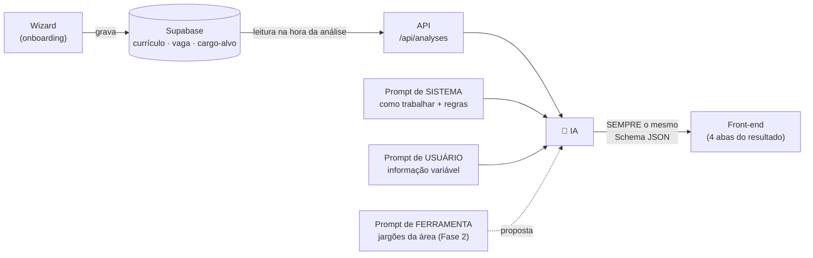
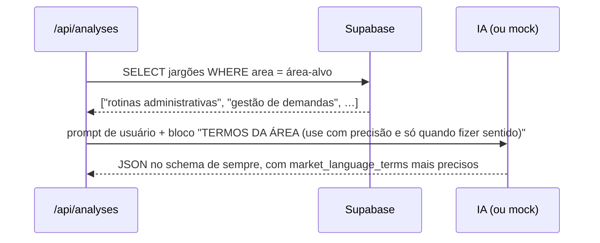
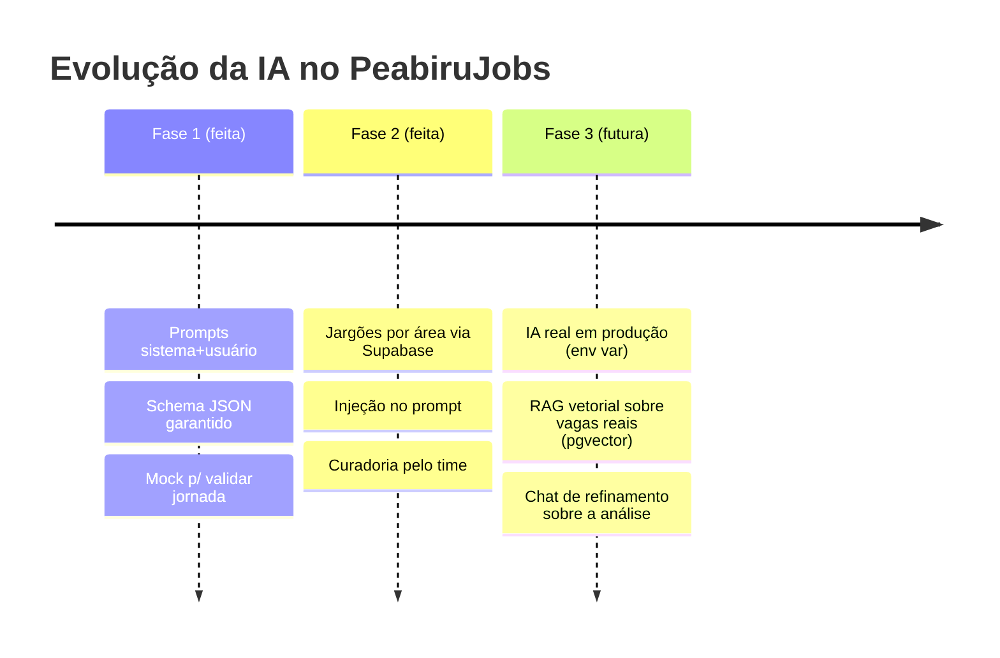

# 🧠 Camada de IA — Fase 1 (implementada) e Fase 2 (proposta)

> Documento de avaliação do time, originado da mentoria Tera AI Product Leaders (07/07).
> **Status:** Fase 1 ✅ implementada e verificável no código · Fase 2 ✅ implementada (degrau A — lookup + injeção no prompt).

---

## 1. O modelo mental do mentor: os 3 prompts

Na mentoria, a arquitetura de interação com a IA foi desenhada em três peças:

| Peça | Pergunta que responde | No PeabiruJobs |
| --- | --- | --- |
| **Prompt de Sistema** | *O que ela vai fazer?* — papel, regras, formato de trabalho | Persona de mentor de carreira + 15 regras de autenticidade + escalas de score |
| **Prompt de Usuário** | *O que o usuário vai usar?* — a informação variável de cada pessoa | Currículo, LinkedIn, cargo-alvo e vaga daquela análise específica |
| **Prompt de Ferramenta** | *O que a ferramenta vai retornar?* — dados externos consultados na hora | (Fase 2) Lista de jargões da área-alvo, consultada no Supabase |

O quadro desenhado em aula, formalizado:



---

## 2. Fase 1 — Prompts estruturados + retorno em Schema JSON ✅

**Está implementada.** Cada elemento que o mentor descreveu existe no código e pode ser verificado:

| Elemento da aula | Onde está | O que faz |
| --- | --- | --- |
| Captura no onboarding | `components/wizard/AnalysisWizard.tsx` → tabelas `career_analyses` e `user_documents` | As 8 etapas gravam os materiais no Supabase |
| Ler do Supabase e mandar para a IA | `app/api/analyses/route.ts` | Autentica, lê os materiais e chama a função de IA |
| Prompt de Sistema | `lib/ai/anthropic.ts` → `SYSTEM_PROMPT` | Papel ("mentor de carreira sênior"), as 15 regras, níveis de score e vereditos permitidos |
| Prompt de Usuário | `lib/ai/anthropic.ts` → `buildUserMessage()` | Monta o bloco variável: cargo-alvo, currículo, LinkedIn, vaga, materiais complementares |
| Retorno estruturado com tipos e limites | `lib/ai/anthropic.ts` → `OUTPUT_SCHEMA` | JSON Schema com enums e tipos por campo, imposto via *structured outputs* |
| "Sempre retorna este schema" | Structured outputs da API da Anthropic | A resposta **não pode** vir fora do formato — é garantia da API, não esperança de parsing |
| JSON vai para o front | Tabelas `recommendations`, `fit_diagnostics`, `evolution_plans` → 4 abas do resultado | O mesmo shape alimenta a interface |

### 2.1 Tipos e limites dos campos (como o mentor pediu)

O schema restringe cada campo — a IA não tem como "inventar formato":

| Campo | Tipo | Limite/valores |
| --- | --- | --- |
| `summary.overall_score` | inteiro | 0–100 |
| `recommendations[].category` | enum | `competencia` · `comunicacao` · `evidencia` · `posicionamento` |
| `recommendations[].impact` / `effort` | enum | `alto` · `medio` · `baixo` |
| `recommendations[].urgency` | enum | `alta` · `media` · `baixa` |
| `recommendations[].authenticity_warning` | string ou null | Obrigatório quando há `suggested_text` (regra do system prompt) |
| `fit_diagnostics[].fit_type` | enum | `cargo_alvo` · `vaga_especifica` |
| `fit_diagnostics[].score` | inteiro | 0–100 |
| `evolution_plan[].priority` | enum | `alta` · `media` · `baixa` |

### 2.2 Exemplo INPUT → OUTPUT (informação variável)

**INPUT (prompt de usuário — muda a cada pessoa):**

```
CARGO-ALVO: Analista Administrativo
SENIORIDADE DESEJADA: Júnior

===== CURRÍCULO =====
Assistente administrativo há 3 anos. Ajudava a equipe no dia a dia,
atendia telefone e organizava documentos. Excel básico.

===== VAGA ESPECÍFICA =====
Analista Administrativo Jr — requisitos: rotinas administrativas,
Excel intermediário, organização de processos, comunicação.
```

**OUTPUT (sempre neste schema — trecho):**

```jsonc
{
  "summary": {
    "overall_score": 68,
    "general_diagnosis": "Seu perfil tem boa aderência a Analista Administrativo Jr…",
    "main_strength": "Experiência real em rotinas administrativas",
    "main_gap": "Descrições genéricas escondem competências que você já tem",
    "next_best_action": "Reescrever a experiência atual detalhando demandas e ferramentas"
  },
  "recommendations": [
    {
      "category": "comunicacao",
      "title": "Traduzir descrição genérica da experiência",
      "impact": "alto", "effort": "medio", "urgency": "alta",
      "original_text": "Ajudava a equipe no dia a dia.",
      "identified_issue": "Não mostra quais demandas, ferramentas ou impacto.",
      "suggested_text": "Apoio às rotinas administrativas da equipe, com organização de demandas, controle de documentos e atendimento.",
      "authenticity_warning": "Use apenas se essas atividades fizeram parte da sua experiência."
    }
  ],
  "fit_diagnostics": [
    { "fit_type": "cargo_alvo", "score": 68, "level": "Boa aderência", "recommendation": "Aplicar com ajustes", "…": "…" },
    { "fit_type": "vaga_especifica", "score": 64, "level": "Aderência parcial", "…": "…" }
  ],
  "evolution_plan": [
    { "action_title": "Evoluir Excel para nível intermediário", "action_type": "Fazer curso", "priority": "alta", "timeframe": "14 dias", "…": "…" }
  ]
}
```

Currículos diferentes, pessoas diferentes → **conteúdo** diferente, **formato** idêntico. É isso que permite o front-end renderizar as 4 abas sem nunca quebrar.

### 2.3 Como validar a Fase 1 hoje (sem custo)

O provider `mock` (padrão) produz esse mesmo schema de forma determinística — a jornada completa funciona sem chave de IA. Ligar a IA real é trocar `AI_PROVIDER=anthropic` + chave. Detalhes: [docs/arquitetura.md](arquitetura.md) §3.

---

## 3. Fase 2 — Jargões por área via consulta ao Supabase ✅ (implementada — degrau A)

> **Implementação:** `supabase/migrations/0002_market_jargons.sql` (tabela com RLS + seed de 10 áreas) · `lib/ai/jargons.ts` (matching por palavras-chave, sem acento) · consulta em `app/api/analyses/route.ts` com fallback silencioso · injeção no prompt em `lib/ai/anthropic.ts` · o mock também consome os termos (demonstrável sem custo de IA). Requer aplicar a migration 0002 no Supabase.

### 3.1 O problema que a fase resolve

A precisão terminológica depende da área: o vocabulário que valoriza um cientista de dados ("pipeline", "feature engineering") não serve para um assistente administrativo ("rotinas", "controle de demandas"). Hoje o campo `market_language_terms` é gerado só com o conhecimento geral do modelo. A Fase 2 dá à IA uma **lista curada de jargões da área-alvo**, vinda do Supabase, no momento da análise.

### 3.2 "Isso não seria um RAG?" — o espectro

Pergunta levantada em aula. Resposta: *é retrieval no espírito; RAG "de verdade" é um dos três degraus:*

| Degrau | Como funciona | Quando usar |
| --- | --- | --- |
| **A. Lookup estruturado** ⭐ recomendado agora | `SELECT termos FROM market_jargons WHERE area = 'dados'` → injeta no prompt de usuário | A chave da busca é conhecida (a área-alvo vem do wizard). Determinístico, barato, zero infra nova |
| **B. Tool use (prompt de ferramenta)** | A IA recebe a ferramenta `consultar_jargoes(area)` e decide chamá-la durante a geração | Quando a IA precisa decidir *se e o quê* consultar (ex.: múltiplas áreas ambíguas). Mais latência (ida-e-volta extra) |
| **C. RAG vetorial (pgvector)** | Embeddings + busca semântica sobre base não estruturada | Quando a base cresce além de listas por chave — ex.: milhares de descrições reais de vagas para comparar com o currículo |

**Regra de bolso:** *sabe a chave da busca → lookup; precisa buscar por significado → RAG.* Como a área-alvo é um campo do formulário, o degrau A entrega 90% do valor com 10% da complexidade. O Supabase já suporta o degrau C (extensão `pgvector`) quando chegarmos lá — sem trocar de stack.

### 3.3 Desenho proposto (degrau A)



**Migration aplicada** (`supabase/migrations/0002_market_jargons.sql`):

```sql
create table public.market_jargons (
  id uuid primary key default gen_random_uuid(),
  area text not null unique,   -- ex.: 'administrativo', 'dados', 'desenvolvimento'
  keywords text[] not null,    -- palavras-chave para casar com cargo/área do wizard
  terms text[] not null,       -- os jargões em si
  usage_note text,             -- orientação de uso p/ IA
  created_at timestamptz not null default now()
);
alter table public.market_jargons enable row level security;
create policy "authenticated read" on public.market_jargons
  for select to authenticated using (true);
-- Escrita: apenas via painel/migrations (tabela curada pelo time)
```

**Seed incluído na migration:** 10 áreas (administrativo, atendimento, dados, desenvolvimento, design, marketing, financeiro, recursos humanos, logística, vendas), ~10 termos cada, com nota de uso que reforça a autenticidade. A curadoria evolui direto pelo painel do Supabase — bom trabalho contínuo para os POs.

**Injeção no prompt** (mudança pequena em `generateCareerAnalysis`): se houver jargões para a área, adiciona ao prompt de usuário um bloco `===== TERMOS DE MERCADO DA ÁREA =====` com instrução de usar com precisão **sem inflar o perfil** (as 15 regras continuam valendo). O mock também consome a lista — dá para demonstrar a Fase 2 sem custo de IA.

### 3.4 Critérios de aceite da Fase 2

- [x] Tabela `market_jargons` criada com RLS e seed de 10 áreas
- [x] Análise de área coberta injeta os termos no prompt (real e mock)
- [x] `market_language_terms` das recomendações passa a refletir os termos curados quando aplicável
- [x] Área sem jargões cadastrados: análise funciona exatamente como antes (fallback silencioso)
- [x] Nenhuma violação das regras de autenticidade (o bloco injetado instrui: usar apenas quando a experiência real sustentar)

### 3.5 Decisões do time

| # | Decisão | Resultado |
| --- | --- | --- |
| 1 | Implementar a Fase 2 agora ou após validar a Fase 1? | ✅ **Decidido: agora** — implementada em 08/07 |
| 2 | Degrau A (lookup) ou B (tool use)? | ✅ **Decidido: A** — B fica documentado como evolução |
| 3 | Quem cura a lista de jargões por área? | 🔍 Em aberto — sugestão: 1 dono por área no time, direto no painel do Supabase |
| 4 | Quando evoluir para o degrau C (pgvector)? | 🔍 Em aberto — somente com base grande não estruturada (ex.: banco de vagas reais) |

---

## 4. Roadmap da camada de IA


