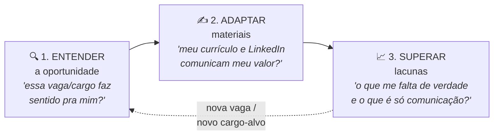
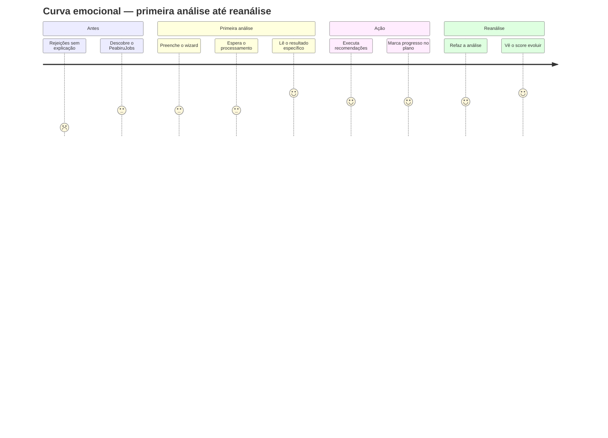

# 🗺 Jornada do Usuário — PeabiruJobs

> Detalhamento da jornada mapeada no discovery ([One Page](one-page.md) §Jornada) conectada às telas do produto construído. Para cada fase: o que o usuário faz, pensa e sente, onde isso acontece no produto e quais são os riscos e oportunidades.

## 1. Os três grandes momentos (discovery)

O discovery consolidou a jornada em três momentos macro. Eles não são lineares — o usuário circula entre eles a cada oportunidade avaliada:

| Momento | Como o produto responde | Resultado esperado |
| --- | --- | --- |
| **Entender a oportunidade** | Diagnóstico de aderência: score 0–100, requisitos atendidos × não atendidos, requisitos inflados, veredito (aplicar agora / com ajustes / desenvolver antes / não priorizar) | Decidir com clareza se vale aplicar |
| **Adaptar materiais** | Recomendações priorizadas (impacto × esforço × urgência) + tradução contextual da experiência com versões prontas para copiar | Comunicar melhor competências reais |
| **Superar lacunas** | Separação lacuna real × comunicação × evidência + plano de evolução com prazos e critérios de sucesso + reanálise comparativa | Caminho prático de evolução |

## 2. Jornada detalhada, fase a fase

### Fase 0 — Antes do produto (contexto emocional)

| | |
| --- | --- |
| **Situação** | Desempregado, em aviso prévio ou insatisfeito; aplicando em massa com o mesmo currículo; recebendo rejeições sem explicação |
| **Pensa** | "Não sei o que está errado. Será meu currículo? Minha experiência? Eu?" |
| **Sente** | Ansiedade, invisibilidade, perda de confiança na própria trajetória |
| **Implicação para o produto** | O tom de toda a experiência precisa ser **acolhedor e não-julgador** — a pessoa chega fragilizada. Nunca culpar; sempre mostrar caminho |

### Fase 1 — Descoberta e decisão de entrar

| | |
| --- | --- |
| **Faz** | Chega à landing page (indicação, busca, redes) |
| **Pensa** | "Mais uma ferramenta de currículo? Isso vai me dar resposta genérica de IA?" |
| **Sente** | Ceticismo com esperança |
| **Tela** | Landing page: promessa central + "como funciona" em 4 passos + aviso de responsabilidade (não prometemos contratação) |
| **Fricções** | Promessas exageradas destruiriam a confiança — por isso o disclaimer é visível |
| **Momento da verdade #1** | A promessa "traduzir sua experiência real, sem inventar nada" é o que diferencia da concorrência — precisa estar clara em 5 segundos |

### Fase 2 — Cadastro

| | |
| --- | --- |
| **Faz** | Cria conta com nome, e-mail e senha |
| **Pensa** | "Espero que seja rápido" |
| **Tela** | `/cadastro` — formulário mínimo, 3 campos |
| **Fricções** | Confirmação de e-mail pode travar o momento de maior motivação (mitigado: confirmação desativada na fase de validação) |

### Fase 3 — Primeira análise (wizard de 8 etapas)

| | |
| --- | --- |
| **Faz** | Envia currículo (arquivo ou texto), LinkedIn (link/PDF/texto), define cargo-alvo, opcionalmente adiciona vaga e arquivos complementares, revisa e gera |
| **Pensa** | "Será que estou preenchendo certo? Quanto falta?" |
| **Sente** | Expectativa crescente; medo de expor o currículo "fraco" |
| **Telas** | `/nova-analise` — barra de progresso, validação por etapa, campos opcionais claramente marcados, revisão final |
| **Fricções mapeadas** | (a) não ter o currículo em texto → campo de colar + orientação; (b) não saber o cargo-alvo → checkbox "quero sugestões"; (c) ansiedade na espera → loading humanizado com mensagens do que está acontecendo |
| **Decisão de UX** | **Formulário guiado, não chat**: a persona não sabe *o que perguntar* a uma IA. O wizard coleta o contexto certo sem exigir habilidade de prompt |

### Fase 4 — O resultado (momento da verdade central)

| | |
| --- | --- |
| **Faz** | Lê o score, o diagnóstico, navega pelas 4 abas |
| **Pensa** | "Isso é sobre MIM ou é resposta de máquina?" |
| **Sente** | O ponto de inflexão emocional da jornada: ou alívio ("finalmente entendi o que ajustar") ou decepção ("genérico…") |
| **Telas** | `/analise/[id]` — score circular, ponto forte / lacuna / próxima ação, abas: Visão geral · Recomendações e tradução · Aderência · Plano de evolução |
| **Momento da verdade #2** | A **primeira recomendação lida** precisa citar algo do material real da pessoa (trecho original → problema → versão sugerida). É o instante que valida a hipótese central do discovery: "específico, não genérico" |
| **Salvaguarda** | Alertas de autenticidade em toda sugestão de texto — protege a confiança que a persona tem de sobra para perder |

### Fase 5 — Ação (executar recomendações)

| | |
| --- | --- |
| **Faz** | Copia sugestões, ajusta currículo/LinkedIn fora do produto, marca recomendações como feitas e ações do plano como concluídas |
| **Pensa** | "Por onde começo?" → respondido pela priorização impacto × esforço × urgência |
| **Sente** | Senso de progresso (barra do plano avançando) |
| **Telas** | Abas de recomendações (filtro por categoria, copiar, marcar como feita) e plano (iniciar/concluir, barra de progresso) |
| **Fricções** | A execução acontece FORA do produto (no LinkedIn, no Word) — o retorno para marcar progresso é o elo frágil. Mitigação atual: plano com critérios de sucesso claros; futuro: lembretes por e-mail |

### Fase 6 — Reanálise (fechamento do ciclo)

| | |
| --- | --- |
| **Faz** | Após ajustar materiais, refaz a análise com os materiais atualizados |
| **Pensa** | "Melhorou de verdade?" |
| **Sente** | Expectativa de validação do esforço |
| **Telas** | `/reanalise/[id]` — wizard pré-preenchido · resultado com comparativo: score anterior → atual, recomendações concluídas, lacunas ainda abertas |
| **Momento da verdade #3** | O **delta do score** é a recompensa emocional do ciclo: prova visível de evolução. Se o score não sobe, o comparativo precisa explicar o porquê com respeito (lacunas reais levam tempo) |
| **Loop** | Da reanálise nasce o próximo ciclo: nova vaga → momento "Entender a oportunidade" de novo |

## 3. Curva emocional da jornada

## 4. Rastreabilidade: jornada × produto construído

| Fase da jornada | Tela/recurso | Status |
| --- | --- | --- |
| Descoberta | Landing page com promessa e disclaimer | ✅ |
| Cadastro | Auth completo (cadastro/login/recuperação) | ✅ |
| Primeira análise | Wizard 8 etapas com validações e loading humanizado | ✅ |
| Não sei o cargo-alvo | Checkbox no wizard | 🔨 capturado; geração de sugestões de cargos ainda não implementada ([PRD](prd.md) RF-2.4) |
| Resultado específico | 4 abas com tradução contextual e alertas de autenticidade | ✅ (formato validado com mock; qualidade com IA real pendente de teste — [docs/ia.md](ia.md)) |
| Ação e progresso | Marcar recomendações/ações, barra de progresso | ✅ |
| Reanálise comparativa | Wizard pré-preenchido + card comparativo | ✅ |
| Retorno/retenção | Lembretes, e-mails | 📋 backlog |
| Pagamento por análise | — | 📋 hipótese de negócio, fora do build atual ([PRD](prd.md) §8) |
