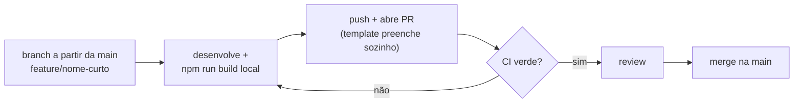

# 🚀 Onboarding — entrando no projeto

> Guia para quem vai contribuir com o PeabiruJobs: acessos, setup local, leitura de contexto e primeira contribuição. Meta: **produtivo em menos de 1 hora**.

## 1. Acessos

| Acesso | Quem concede / onde | Quando é necessário |
| --- | --- | --- |
| **GitHub** (obrigatório) | Dono do repositório → Settings → Collaborators → *Add people* | Sempre — o repositório é privado |
| **Supabase** (opcional) | Dono da organização → supabase.com → Organization → Members → *Invite* | Só para mexer em banco, auth ou policies. Para desenvolver features, bastam as chaves no `.env.local` |
| **Vercel** (opcional) | Dono do projeto na Vercel | Raramente — previews de PR são automáticos; convite só para ver logs/configurações |

### Política de segredos

- ✅ **Pode circular no time:** URL do projeto Supabase e a **anon/publishable key** (pública por design — o RLS protege os dados)
- ❌ **Nunca compartilhar / nunca commitar:** `service_role` key, tokens de gerenciamento (`sbp_…`), `ANTHROPIC_API_KEY`, arquivos `.env*`

## 2. Setup local (~5 minutos)

Pré-requisito: Node.js 20+.

```bash
git clone https://github.com/akamitatrush/PeabiruJobs.git
cd PeabiruJobs
npm install
cp .env.example .env.local    # preencher NEXT_PUBLIC_SUPABASE_URL e NEXT_PUBLIC_SUPABASE_ANON_KEY
npm run dev                   # → http://localhost:3000
```

Sanity check: criar uma conta local, rodar uma análise (o provider `mock` é o padrão — não precisa de chave de IA) e ver o resultado nas 4 abas.

## 3. Leitura de contexto (~20 minutos)

Na ordem:

1. **[README](../README.md)** — o que é o produto, diagramas e stack
2. **[CONTRIBUTING.md](../CONTRIBUTING.md)** — convenções de código, branches e migrations
3. O documento da sua área:
   - PO / negócio → [docs/produto.md](produto.md)
   - Dev front/back → [docs/arquitetura.md](arquitetura.md)
   - Infra → [docs/devops.md](devops.md)
   - Todos, em algum momento → [docs/seguranca.md](seguranca.md)

## 4. Fluxo de contribuição



- **Branches:** `feature/…`, `fix/…`, `docs/…` — sempre a partir da `main` atualizada
- **PR:** o template pede resumo, tipo, *como testar* e checklist — capriche no "como testar"
- **CI:** o GitHub Actions roda o build a cada push; PR vermelho não entra em review
- **Migrations:** mudou schema? Arquivo novo em `supabase/migrations/` (nunca editar migration aplicada) e **toda tabela nova nasce com RLS**

## 5. Checklist da primeira contribuição

- [ ] Acesso ao GitHub recebido e clone feito
- [ ] `npm run dev` rodando com `.env.local` preenchido
- [ ] Conta de teste criada e uma análise gerada localmente
- [ ] CONTRIBUTING.md lido
- [ ] Primeira branch criada a partir da `main`
- [ ] Primeiro PR aberto com o template preenchido e CI verde

## 6. Não é dev? Contribua mesmo assim

POs e perfis não-técnicos podem contribuir via **Claude Code** (texto, documentação, ajustes de UI, investigações) sem tocar em terminal — o fluxo de PR + CI + review protege tudo. Guia completo: **[docs/claude-code.md](claude-code.md)**.

## 7. Dúvidas frequentes

| Pergunta | Resposta |
| --- | --- |
| Preciso de chave da Anthropic para desenvolver? | Não — `AI_PROVIDER=mock` (padrão) simula a análise |
| Posso usar o mesmo projeto Supabase que o time? | Sim na fase atual (PoC). Com o produto em produção, separaremos dev/prod ([devops.md](devops.md) §1) |
| Onde reporto bugs/ideias? | Issues do GitHub — descreva o passo a passo e anexe screenshot |
| Quebrei a `main`? | Não dá: a `main` é protegida — só entra código via PR com CI verde e review |
