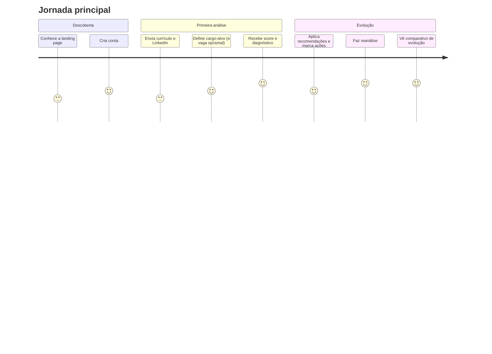

# 📋 Documentação de Produto (PO)

> Documento vivo. Fonte da verdade sobre **o que** o PeabiruJobs faz e **por quê** — decisões de escopo, personas, histórias de usuário e critérios de aceite.

## 1. Visão do produto

**Problema:** profissionais brasileiros em recolocação ou transição de carreira têm dificuldade em comunicar sua trajetória real. Currículos genéricos, LinkedIn desatualizado e falta de clareza sobre aderência a vagas fazem candidatos qualificados serem descartados na triagem.

**Proposta de valor:** um mentor de carreira com IA que analisa os materiais reais do usuário e devolve (1) recomendações priorizadas, (2) diagnóstico de aderência com score e (3) um plano de evolução acompanhável — sempre preservando autenticidade.

**Posicionamento:** o PeabiruJobs **não** é um gerador de currículo, **não** promete contratação e **não** inventa experiências. É uma ferramenta de clareza e estratégia.

### Métricas de sucesso sugeridas (North Star + apoio)

| Métrica | O que indica |
| --- | --- |
| ⭐ Usuários que concluem 1ª análise | Ativação — o wizard funciona e entrega valor |
| Recomendações marcadas como feitas / usuário | Engajamento com o valor central |
| Taxa de reanálise | Retenção — o ciclo de evolução fecha |
| Δ médio de score entre análise e reanálise | Valor percebido e mensurável |
| % análises com vaga específica | Profundidade de uso |

## 2. Personas

### Persona A — "Recolocação urgente"
- **Quem:** profissional operacional/administrativo, 25–45 anos, desempregado ou em aviso prévio
- **Dor:** manda dezenas de currículos sem retorno; não sabe o que está errado
- **Ganho esperado:** entender *o que ajustar primeiro* e aplicar com materiais melhores

### Persona B — "Transição de carreira"
- **Quem:** profissional com experiência que quer mudar de área/cargo (ex.: analista → product designer)
- **Dor:** sente que "não tem os requisitos" — mas parte disso é lacuna de comunicação, não de competência
- **Ganho esperado:** separar lacunas reais (para desenvolver) de lacunas de comunicação (para reescrever)

## 3. Jornada do usuário

## 4. Épicos e histórias de usuário

### Épico 1 — Recomendações e tradução contextual

| # | História | Critérios de aceite |
| --- | --- | --- |
| 1.1 | Como usuário, quero ver recomendações **priorizadas** para saber o que ajustar primeiro | Lista ordenada por prioridade; cada item exibe impacto, esforço e urgência |
| 1.2 | Como usuário, quero **filtrar por categoria** (Competência, Comunicação, Evidência, Posicionamento) | Filtro funcional na aba de recomendações |
| 1.3 | Como usuário, quero ver **traduções** dos meus textos genéricos | Bloco com texto original → problema → versão sugerida → termos de mercado |
| 1.4 | Como usuário, quero **copiar** a sugestão e **marcar como feita** | Botões funcionais; status persiste no banco |
| 1.5 | Como usuário, quero confiar que **nada foi inventado** | Alertas de autenticidade presentes; regras da IA aplicadas |

### Épico 2 — Diagnóstico de aderência

| # | História | Critérios de aceite |
| --- | --- | --- |
| 2.1 | Como usuário, quero um **score 0–100** com explicação | Score + nível textual + justificativa exibidos |
| 2.2 | Como usuário, quero diagnóstico do **cargo-alvo** mesmo sem vaga | fit_type `cargo_alvo` sempre gerado |
| 2.3 | Como usuário, quero diagnóstico **da vaga** quando eu enviar uma | fit_type `vaga_especifica` adicional |
| 2.4 | Como usuário, quero distinguir **lacuna real × comunicação × evidência** | Lacunas classificadas na resposta e explicadas na UI |
| 2.5 | Como usuário, quero uma **recomendação final clara** | Um dos 4 veredictos padronizados |

### Épico 3 — Plano de evolução e reanálise

| # | História | Critérios de aceite |
| --- | --- | --- |
| 3.1 | Como usuário, quero um **plano com prazos e critérios de sucesso** | Ações com tipo, prioridade, prazo e critério |
| 3.2 | Como usuário, quero **marcar progresso** (pendente → em andamento → concluída) | Status persiste; barra de progresso reflete |
| 3.3 | Como usuário, quero **reanalisar** após ajustes | Wizard pré-preenchido a partir da análise original |
| 3.4 | Como usuário, quero ver **comparativo** (score anterior → atual, lacunas abertas) | Card de comparativo na visão geral da reanálise |

### Épico 4 — Estrutura de produto

| # | História | Critérios de aceite |
| --- | --- | --- |
| 4.1 | Cadastro/login/logout/recuperação de senha | Fluxos completos via Supabase Auth |
| 4.2 | Dashboard com resumo e histórico | Cards de totais + lista de análises com status |
| 4.3 | Wizard de análise em etapas | 8 etapas com barra de progresso e validações |
| 4.4 | Responsividade desktop e mobile | Layout funcional em ambos |

## 5. Regras de negócio (invioláveis)

1. Não inventar experiências, métricas, ferramentas ou certificações
2. Não prometer contratação nem prever aprovação
3. Não transformar atividade operacional em liderança
4. Toda sugestão de texto acompanha alerta de autenticidade
5. Diferenciar lacuna real × comunicação × evidência × posicionamento
6. Toda recomendação tem justificativa ("por quê")
7. Linguagem clara, acolhedora e prática (pt-BR)
8. Com baixa confiança, pedir complemento em vez de supor

## 6. Fora de escopo do MVP (decisões conscientes)

| Item | Motivo |
| --- | --- |
| Parsing automático de PDF/DOC | Frágil para PoC; texto colado cobre o fluxo |
| Scraping do LinkedIn | Viola os termos da plataforma |
| Pagamentos/planos | Validar valor antes de monetizar |
| Sugestão automática de cargos ("não sei qual cargo") | Registrado no wizard; geração dedicada fica para v2 |
| E-mails transacionais | Depende de SMTP próprio |

## 7. Backlog priorizado (v2)

1. **Parser de PDF/DOCX server-side** — remove a maior fricção do wizard
2. **Sugestão de cargos** para quem marca "não sei qual cargo buscar"
3. **Gráfico de evolução do score** ao longo das reanálises
4. **Exportar recomendações em PDF**
5. **E-mails transacionais** (boas-vindas, plano concluído, lembrete de reanálise)
6. **Onboarding guiado** na primeira análise
